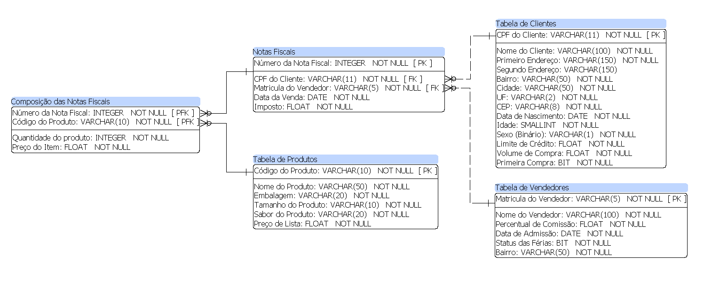
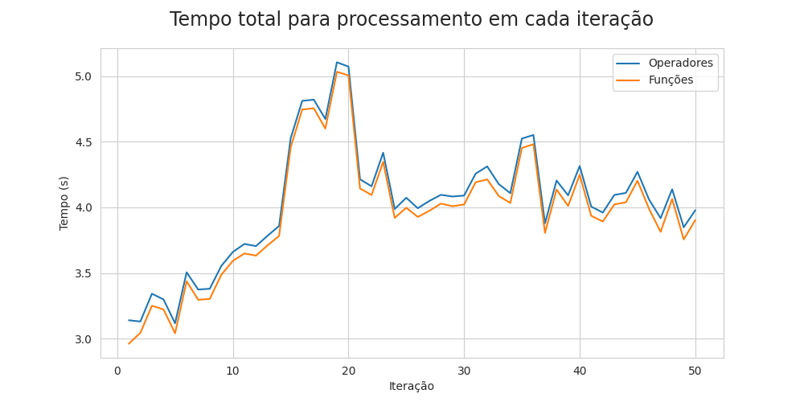

# Data Generator
Projeto pessoal em desenvolvimento para estudo dos principais conceitos e stacks utilizados na área de Engenharia de Dados. O projeto consiste:
- no desenvolvimento de um gerador de dados, 
- na alimentação de um banco de dados estruturado e na 
- apresentação de indicadores.

### Objetivos:
- Aumento na compreensão acerca de pipelines de dados
- Aprimoramento na utilização das seguintes stacks:
    - Apache Airflow
    - Docker
    - Kubernetes
    - Python
    - Jinja Templates
    - SQL

### Estrutura de Diretórios:
```
├── /app
├── /casestudy
├── /imgs
├── /raw_code_env
|   ├── /app
|   |   ├── /dags
|   |   ├── /plugins
|   |   |   ├── /hooks
|   |   |   ├── /operators
|   |   |   ├── /utils
|   ├── /datalake
|   |   ├── /silver (preprocessed)
|   |   |   ├── /database_name
|   |   |   |   ├── /table
|   |   |   |   ├── ...
|   ├── /docker_engines
|   ├── /docker_env 
|   |   ├── /airflow
|   |   ├── /datalake
|   |   ├── /silver (preprocessed)
|   |   |   ├── /database_name
|   |   |   |   ├── /table
|   |   |   |   ├── ...
|   |   ├── /datawarehouse
|   ├── /environmentcreator 
|   |   ├── /dump
```
### Stack utilizadas até o momento:
- Python
- Mysql/MariaDB
- JinjaSql
- Pandas
- Bash Scripting
- SQL Power Architect
- Docker
- Kubernetes

### Modelagem do Banco de Dados:
- Modelagem Relacional
- Estrutura:

 

### Decisões de Projeto:
- As tabelas ``Tabela de Clientes``, ``Tabela de Vendedores`` e ``Tabela de Produtos`` se manterão inalteradas, ou seja, sem inserção ou remoção de dados. Com base nessas tabelas, serão gerados novos dados para as tabelas ``Notas Fiscais`` e ``Composição de Notas Fiscais``.
- A quantidade de dados armazenados e a quantidade de requisições ao banco implicam diretamente no desempenho do pipeline. Dessa forma, para que o processo de geração de dados se tornasse performático, a utilização de armazenadores locais temporários (como dicionários) foram preteridos para as tabelas estáticas ( ``Tabela de Clientes``, ``Tabela de Vendedores`` e ``Tabela de Produtos``) que continham uma baixa quantidade de dados e necessitavam de muitas requisições. Para casos opostos, optou-se pela requisição direta ao banco, pois, além de não haver necessidade na utilização de todos os dados, as tabelas que se enquadravam nesse caso ( ``Notas Fiscais`` e ``Composição de Notas Fiscais``) terão um aumento de informação constante, o que consequentemente aumentaria o tempo de processamento.
- Optou-se pela utilização dicionários como estrutura de dados temporárias, pois proporcionou uma melhora significativa, em questão de velocidade de transporte e processamento, quando comparado com o pandas dataframe.
- A carga de dados através de arquivos CSV proporcionou uma inserção de dados no banco de até 10x mais rápida se comprado com a função ```to_sql``` do pandas dataframe.
    - Principalmente por dois motivos: 
        - Não há análise de sql e
        - O engine armazena antes em cache para depois inseri as informações em grandes blocos.

### Pontos observados no caso estudado:

#### Experimento 1 - foco no processo de geração de dados:
- Total de dados na tabela ``Tabela de Clientes``: 15
- Total de dados na tabela ``Tabela de Vendedores``: 4
- Total de dados na tabela ``Tabela de Produtos``: 31
- Total de interações: 50
- Total de notas fiscais geradas por iteração: 100.000
- Total de itens por notas fiscais geradas em cada iteração: 1
- Total de registros gerados e inseridos: 10.000.000
- Tempo total para geração dos dados: 133,08 segundos (2 minutos e 22 segundos)
- Tempo total para inserção dos dados: 68,48 segundos (1 minuto e 14 segundos)
- Tempo total: 201,56 segundos (3 minutos e 36 segundos)

|  |
|:--:|
|<b>Fig 1 - Tempo total necessário para o processamento do fluxo completo e das funções principais dos Operadores (Geração e Importação). </b>|

|  |
|:--:|
|<b>Fig 2 - Gráficos que representam o tempo de processamento utilizado pelo fluxo completo e das funções principais pelos operadores Generator e Import, respectivamente. </b>|

#### Conclusão:
- A utilização de armazenadores locais para tabelas estáticas geraram um aumento baixo e constante no tempo de processamento do pipeline, com mediana de ``0,072 segundos``, como pode ser visualizado na Fig 1. Observação: nesse acréscimo de tempo está incluso também o processo de criação de conexão com o banco. 
- A taxa de crescimento por iteração composta para o operador ``Generator`` é de ``0.87%``, com um desvio médio de ``0,43 segundos``. Isso se deve ao custo gerado pelas requisições (100.000 requisições por iteração) a tabela ``Notas Fiscais`` conforme o aumento de dados a cada iteração. A tendência, como mostrado na Fig 2, é um crescimento no tempo de processamento conforme a quantidade de dados na tabela aumente.
- Através da Fig 2, notamos que ainda podemos melhorar o pipeline de dados, mais precisamente no operador ``Generator``. Com a tendência de aumento de tempo de processamento conforme o aumento da quantidade de dados na base, podemos usar algumas metodologias para tornar o processo mais performático, como a utilização de cache local para diminuir o número de requisições ao banco e de ferramentas que possibilitam o processamento em batch para paralelizar a task de geração de dados.
- Como pode ser visto também na Fig 2, o operador ``Insert`` não possui uma tendência de crescimento no tempo de processamento pelo fato da quantidade de dados em cada iteração se manter constante (100.000 registros por tabela). A variação observada pode ser explicada pelo fato das requisições ao banco não serem idênticas (tamanho em bytes de um campo, por exemplo) e pelo tempo de resposta do banco a cada requisição (possa haver instabilidades na conexão).

#### Experimento 2 - foco no processo de inserção de dados:
#### Conclusão:

### Próximos Passos:
- Criar ambiente em docker
- Utilizar um orquestrador/scheduler (Airflow)
- Gerar insights através da base gerada (desenvolver KPIs para monitoramento)
