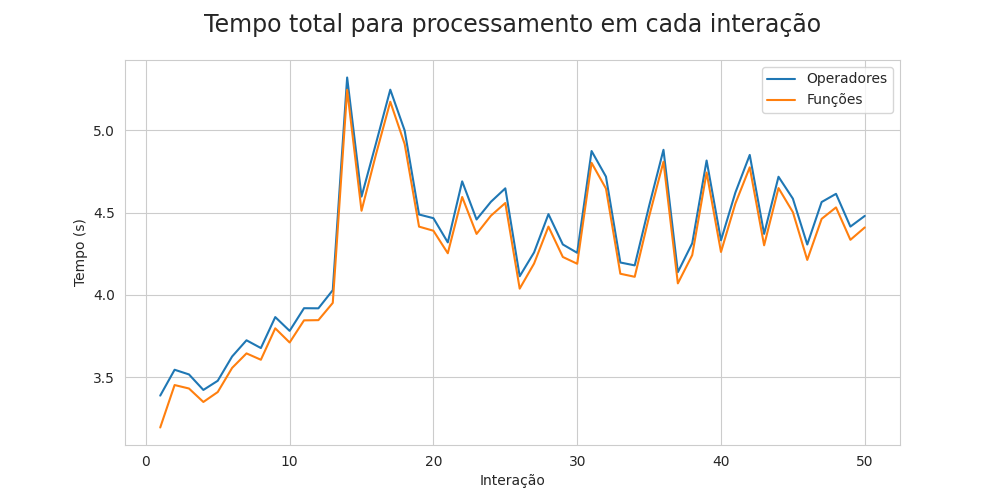
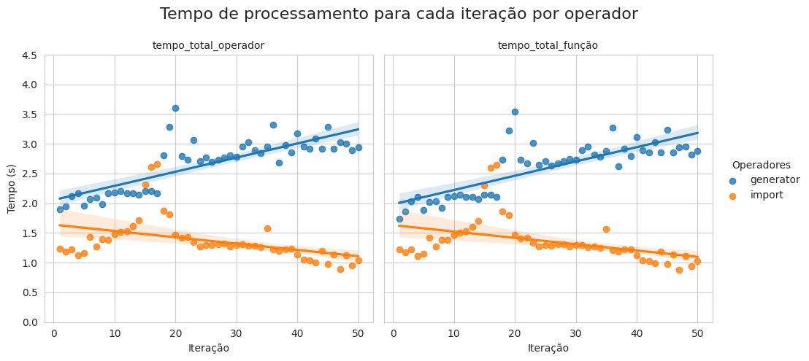

# Data Generator
Projeto pessoal em desenvolvimento para estudo dos principais conceitos e stacks utilizados na área de Engenharia de Dados (ED). O projeto consiste no desenvolvimento de um gerador de dados, alimentação de um banco de dados estruturado e na modelagem de visualizações de Key Performance Indicators (KPIs).

### Objetivos:
- Aumento na compreensão acerca de pipelines de dados
- Aprimoramento na utilização das seguintes stacks:
    - Apache Airflow
    - Docker
    - Python
    - Apache Spark
    - Jinja Templates
    - SQL

### Estrutura de diretórios
```
├── /src (data-generator)
|   ├── /app
|   |   ├── /dags
|   |   ├── /plugins
|   |   |   ├── /hooks
|   |   |   ├── /operators
|   |   |   ├── /utils
|   ├── /casestudy
|   ├── /datalake
|   |   ├── /silver (preprocessed)
|   |   |   ├── /DB_NAME
|   |   |   |   ├── /SUBFOLDER1
|   |   |   |   ├── ...
|   ├── /environmentcreator  
|   ├── /imgs
```
### Stack Utilizadas até o momento:
- Python
- Mysql/MariaDB
- JinjaSql
- Pandas
- Bash Scripting
- SQL Power Architect
- Datalake

### Modelagem do Banco de Dados:
- Modelagem Relacional
- Estrutura:

 

### Decisões de projeto:
- As tabelas ``Tabela de Clientes``, ``Tabela de Vendedores`` e ``Tabela de Produtos`` se manteram inalteradas, ou seja, sem inserção ou remoção de dados. Com base nessas tabelas, serão gerados novos dados para as tabelas ``Notas Fiscais`` e ``Composição de Notas Fiscais``.
- A quantidade de dados armazenados e a quantidade de requisições ao banco implicam diretamente na performance do pipeline. Dessa forma, para que o processo de geração de dados se tornasse escalável
    - a utilização de armazenadores locais temporários (como dicionários) foram preteridos para as tabelas estáticas ( ``Tabela de Clientes``, ``Tabela de Vendedores`` e ``Tabela de Produtos``), com baixa quantidade de dados, e que necessitavam de muitas requisições.
    - Para casos opostos, optou-se pela requisição direta ao banco pois, além de não haver necessidade na utilização de todos os dados, as tabelas que se enquadravam nesse caso ( ``Notas Fiscais`` e ``Composição de Notas Fiscais``) terão um aumento de informação constante, o que consequentemente aumentaria o tempo de processamento.

### Pontos obeservados no caso estudado:

Experimento realizado:
- Total de interações: 50
- Total de notas fiscais geradas por interação: 100.000
- Total de itens por notas fiscais geradas em cada interação: 1
- Total de registros gerados e inseridos: 10.000.000


|  |
|:--:|
|<b>Fig 1 - Tempo total necessário para o processamento do fluxo completo e das funções principais dos Operadores (Geração e Importação). </b>|

|  |
|:--:|
|<b>Fig 2 - Gráficos que representam o tempo de processamento utilizado pelo fluxo completo e das funções principais pelos operador Generator e Import, respectivamente. </b>|

- A utilização dicionários como estrutura de dados proporcionou uma melhora significativa, em questão de velocidade de transporte e processamento, no pipeline de dados quando comparado com o pandas dataframe. 
- A carga de dados através de arquivos CSV proporcionou uma inserção de dados no banco de até 10x mais rápida se comprado com a função ```to_sql``` do pandas dataframe.
    - Principalmente por dois motivos: 
        - Não há análise de sql e
        - O engine armazena antes em cache para depois inseri as informações em grandes blocos.


### Próximos Passos:
- Gerar relatórios para comprovar o insights descritos
- Criar ambiente em docker
- Utilizar um orquestrador/scheduler (Airflow)
- Gerar insights através da base gerada (desenvolver KPIs para monitoramento)
